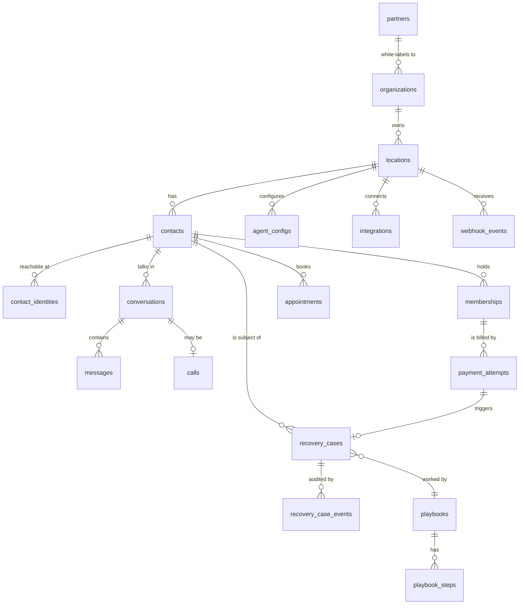

# Data model

The schema lives in [`../db/migrations/0001_init.sql`](../db/migrations/0001_init.sql).
Every decision that would be expensive to reverse is marked `WHY` in that file.
This document is the map and the argument; the SQL is the source of truth.

**Postgres 16.** Plain SQL migrations, no ORM. You are learning to read this
code, and an ORM would hide exactly the parts worth understanding.

---

## The shape of it

Twenty tables in five groups. Read them in this order.



| Group | Tables | Job |
|---|---|---|
| Tenancy | `partners`, `organizations`, `locations`, `staff_users`, `staff_roles` | Who owns what, who can see what |
| People | `contacts`, `contact_identities` | The humans the agent talks to |
| Conversations | `conversations`, `messages`, `calls`, `appointments`, `agent_configs` | What was said, what got booked |
| Money | `memberships`, `payment_attempts`, `recovery_cases`, `recovery_case_events` | The product |
| Plumbing | `playbooks`, `playbook_steps`, `integrations`, `webhook_events` | Cadence and the outside world |

---

## The six decisions worth arguing about

If you disagree with any of these, now is the cheap moment to say so.

### 1. `recovery_cases` is the centre of the product

All five kinds of leaking money — a declined card, a member who stopped
showing up, a cancellation request, a lead who never booked, a missed call —
become one row in one table with a `kind` column.

The alternative is separate `failed_payments`, `winbacks` and `missed_leads`
tables. That feels tidier and is wrong, because the number the gym owner buys
is a **single sum across all of them**. One table makes the dashboard one
query, the work queue one query, and a sixth recovery type a new value in a
check constraint rather than a new subsystem.

The cost is five nullable foreign keys (`membership_id`, `payment_attempt_id`,
`conversation_id`, `call_id`, `appointment_id`), only one or two of which are
set for any given `kind`. That is a real ugliness and it is worth paying.

### 2. One `contacts` table, not `leads` + `members`

A lead becomes a member; a member cancels and becomes a winback target. Two
tables means copying rows between them and **losing the conversation history
at exactly the moment it is most valuable**. Lifecycle is a column.

### 3. Identities are separate rows

One person is a phone number, an email, an Instagram handle, and an ID in the
gym's CRM. Columns on `contacts` would cap you at one of each and leave you no
way to merge duplicates. The unique index on
`(location_id, kind, value)` is the actual deduplication mechanism: an inbound
text from a known number resolves to the existing contact instead of creating
a twin who gets the same dunning sequence twice.

### 4. Three levels of tenancy, decided now

`partner → organization → location`.

A partner brands the product. An organization is the business that pays. A
location is one gym with one phone number, one timezone, one set of members.
A four-gym group needs shared billing and separate phone numbers — that
distinction *is* organization vs location.

Two levels would work today and break the moment you sign your first franchise
group, which is the white-label endgame. **Adding a tenancy level later means
rewriting every query and every permission check in the product.** Adding it
now costs one table and one foreign key.

`locations.partner_id` is deliberately denormalized so that scoping never
needs a three-table join.

### 5. Money is integer cents, rates are basis points

`price_cents integer`, never `numeric` and absolutely never a float. In binary
floating point `0.1 + 0.2 != 0.3`, which produces invoices off by a penny and
reports that do not reconcile. `revenue_share_bps = 1500` means 15.00%.

### 6. Attribution is frozen at resolution time

`recovery_cases.attributed` is a stored boolean with an
`attribution_basis` explaining why, not a rule evaluated at read time.

When you tighten the attribution rule in six months — and you will — last
quarter's invoices must not silently change. You freeze the decision when the
case resolves and keep the historical number defensible.

This is the single most commercially important column in the schema. See the
open question below.

---

## Guarantees the database enforces

These are constraints, not conventions, because conventions are things the
code forgets at 2am. All five are proved by
[`../db/smoke_test.sql`](../db/smoke_test.sql), which fails loudly if any bad
write is allowed through.

| Guarantee | Mechanism |
|---|---|
| One contact per phone number per gym | unique index on `contact_identities` |
| A role cannot be scoped to the wrong level | `staff_roles_scope_matches_role` check |
| Exactly one live agent config per gym | partial unique index `where is_active` |
| A replayed provider webhook cannot double-charge or double-text | partial unique indexes on `(provider, provider_*_id)` |
| Money cannot go negative | check constraints on every `*_cents` column |

The idempotency indexes matter more than they look. Twilio and Stripe both
retry webhook deliveries. Without those indexes, one network hiccup becomes a
member receiving the same text four times — which is the kind of thing that
loses an account in week one.

---

## Two things the schema takes a position on

**Consent is modelled explicitly.** `contacts.consent_sms_at`,
`consent_source`, `opted_out_at`. US SMS marketing is governed by the TCPA and
statutory damages are assessed per message. "Did this person agree, when, and
have they since opted out?" has to be a column you can produce in a
deposition, not an inference from message history. Every outbound query filters
on `opted_out_at is null`.

**Timezone is `not null` on locations.** The agent sends outbound messages.
Texting a member at 3am is how you lose an account on day two, quiet hours are
meaningless without a timezone, and a chain can span several.

Neither of these is over-engineering. Both are cheap now and painful to
retrofit.

---

## Deliberately not here yet

Listed so the omissions are visible choices rather than oversights:

- **Your own billing.** How *you* charge the gym. Stripe holds this until it
  needs to be queryable.
- **Class schedules and check-ins.** Read from the gym's CRM; do not become a
  system of record for something they already have.
- **Analytics rollup tables.** Add when the dashboard query gets slow, with
  a measurement in hand. Not before.
- **Staff audit log.** Needed for enterprise deals, not for the first ten gyms.
- **Playbook A/B testing.** `playbooks` and `playbook_steps` are thin on
  purpose — expect to rework them after watching real cases run.

---

## Open questions

These are business decisions, not technical ones, and the first paying
customer settles them.

1. **What counts as recovered?** If the agent texts on Monday and the member
   updates their card on Thursday without replying, did you recover it? The
   schema supports any answer via `attribution_basis`; you have to pick one
   that survives a skeptical gym owner reading it. Suggested starting rule:
   agent touched the case, and payment succeeded within 14 days, and no staff
   member contacted them first. Write it down before the first invoice.
2. **Whose data is it in a white-label deal?** When a partner churns, does
   their gyms' conversation history go with them? The schema supports a clean
   per-partner export; the contract needs to say so.
3. **Does the agent ever leave voicemail?** Different consent posture,
   different state-by-state rules, meaningfully different build.

---

## Running it

```bash
createdb revagent
psql "postgresql://localhost/revagent" -v ON_ERROR_STOP=1 -f db/migrations/0001_init.sql
psql "postgresql://localhost/revagent" -v ON_ERROR_STOP=1 -f db/smoke_test.sql
```

The smoke test walks a declined card through to recovered revenue, asserts the
five guarantees above, prints the dashboard, and rolls back. It leaves nothing
behind.
